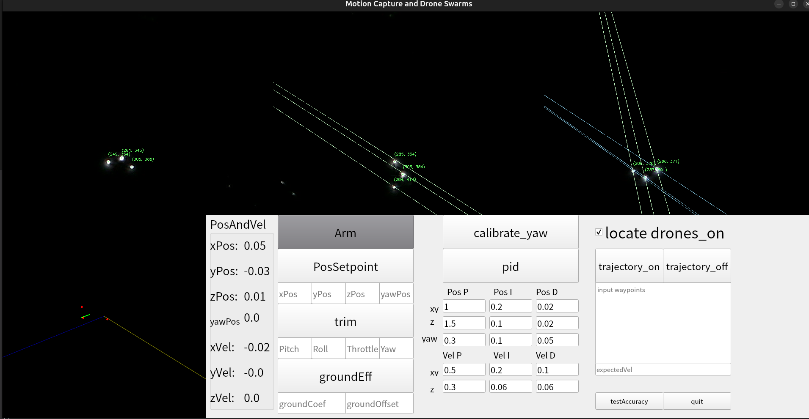
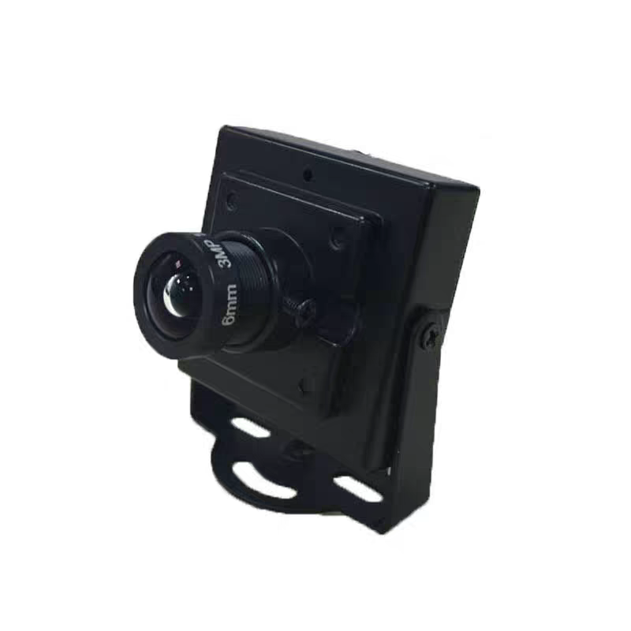
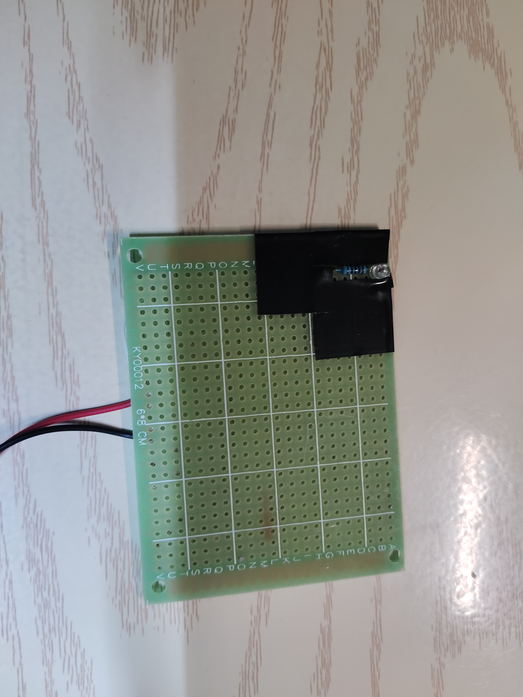
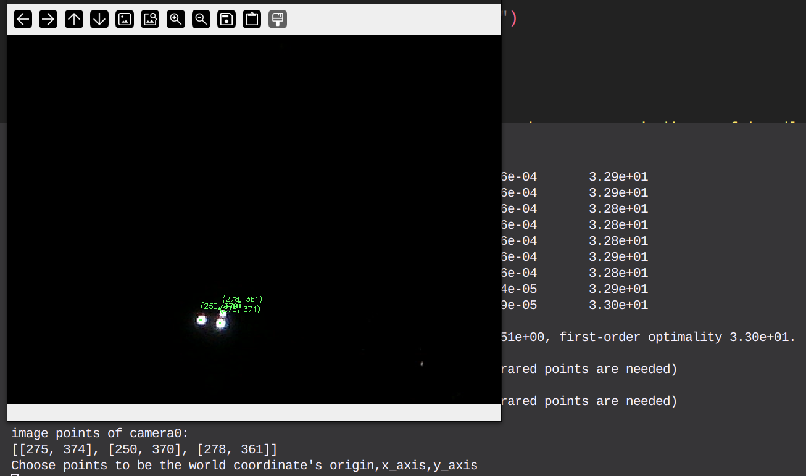
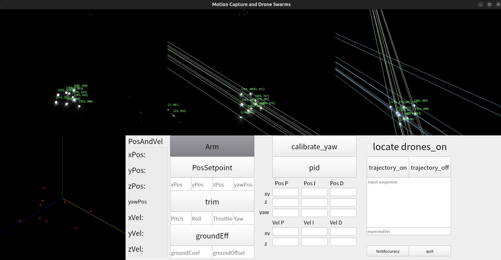

# First of all
This is a reimplement of [Joshua Bird's repository](https://github.com/jyjblrd/Low-Cost-Mocap)
It might be considered an easier version, since the React frontend has been replaced with a PyQt frontend, and the no-cv-sfm branch is used.
There is a [YouTube video](https://youtu.be/QF4qJRMAZwg) demonstrating the drone's hover and the use of the PyQtFrontend

# What's changed?
(1) I build a PyQtFrontend instead of using ReactFrontend.

(2) I separated the [intrinsic](computer_code/acquire_intrinsic_params.py) and [extrinsic](computer_code/acquire_extrinsic_params.py) parameter acqusition into independent Python programs.  
(3) I rewrote the [point correlation algorithm](computer_code/mocap/helpers.py#L323-L408).  
(4) I rewrote the [receiver.cpp L43-44](esp32_receiver/src/receiver.cpp#L43-L44)[receiver.cpp L193-198](esp32_receiver/src/receiver.cpp#L195-L198) so that both hovering and trajectory tracking can have a specified heading/yaw value. The PID output is in world coordinate, so we need to project it into the drone's local coordinate system, which corresponds to the SBUS values.  
(5) I customized the [Arduino PID library code .cpp](esp32_receiver/src/PID_v1_bc.cpp#L47-L139)and [Arduino PID library code .h](esp32_receiver/src/PID_v1_bc.h), in this way, if yaw = -π + 0.05 and yawSetpoint = π - 0.05, the drone can intelligently choose the shorter path (−0.1) instead of the longer one (2π − 0.1).  
(6) I used  instead of ps3-eye camera. 3 cameras are used(theoretically, 4 or more cameras are also feasible).  
(7) I used the [no-cv-sfm branch](https://github.com/jyjblrd/Low-Cost-Mocap/tree/no-cv-sfm)(actually the [3 alternative functions](computer_code/mocap/helpers.py#L508-L571)) to avoid the hassle of compiling cv-sfm.  
(8) There are many minor changes that are hard to explain, as I’ve almost reconstructed the original project. However, the core functionality remains largely unchanged — or rather, the math behind the motion capture is still the same.

# How to run the code?
(0) I have 3 cameras: camera0 (ID 4), camera1 (ID 6), and camera2 (ID 8). The numbers 0, 1, and 2 are user-defined labels, while 4, 6, and 8 are the device indices used in OpenCV (e.g., camera = cv.VideoCapture(4)), which may vary depending on the system.  
(1) Run [acquire_intrinsic_params.py](computer_code/acquire_intrinsic_params.py) to obtain the intrinsic parameters, and fill them into [camera-params_copy.json](computer_code/mocap/camera-params_copy.json). This needs to be done for each camera individually.  
(2) Run [acquire_extrinsic_params.py](computer_code/acquire_extrinsic_params.py) to obtain the extrinsic parameters for camera pairs (0&1, 0&2). The files [camera_poses01.npy](computer_code/extrinsic/camera_poses01.npy) and [camera_poses02.mpy](computer_code/extrinsic/camera_poses02.npy) will be generated in the extrinsic directory. First, move a  and capture 10 images from each of the two cameras to obtain preliminary camera poses. Then, move  (where actual_distance refers to the known distance between them, e.g., 0.1024 m) and capture another 10 images to determine the scale. The [number of images](computer_code/acquire_extrinsic_params.py#L10) and the [actual_distance](computer_code/acquire_extrinsic_params.py#L11) must be specified.  
(3) Run [ba_and_twm.py](computer_code/ba_and_twm.py) to perform bundle adjustment and obtain the [camera_to_world_matrix.npy](computer_code/extrinsic/camera_to_world_matrix.npy) (all cameras should be connected at this stage). Then, you can run [frontend.py](computer_code/frontend.py) to test pure localization without the drone (you'll need to connect the computer to an ESP32). Make sure to specify the serial port in the [SERIAL_PORT](computer_code/frontend.py#L55) variable, e.g., /dev/ttyACM0. Similarly, capture 10 images for this step. Finally, capture one image with 3 markers to determine the to_world_matrix. In my setup, I use  and choose one point as the origin, with the other two points representing the directions of the x- and y-axes from .  
(4) Flash the [esp32_sender](esp32_sender/src/sender.cpp) for the computerside and the [esp32_receiver](esp32_receiver/src/receiver.cpp) for the droneside.  
(5) Run [frontend.py](computer_code/frontend.py) to use the UI and control the drone.

# How to use the UI?
(1) 

# What is the reimplement's flaw?
(1) Locate about more than 6(approximately) points is unstable, probably due to the point correlation algorithm or the camera calibration's bad accuracy.
(2) It cannot locate and control two or more drones at the same time. In fact, controlling two drones is possible by adding a Kalman Filter (which essentially uses the previous state to predict the next one, and then uses the predicted state to help resolve multiple drone matches). However, locating three or more drones to build a swarm is not feasible due to the limited positioning accuracy of this reimplementation. Therefore, I decided not to implement the Kalman Filter or support multiple drones.

# Finally
The origin project is really amazing and I've learned so much from it.
Please kindly excuse any awkward expressions due to my limited English, and also forgive any bugs in the code as I’m still improving my programming skills.
